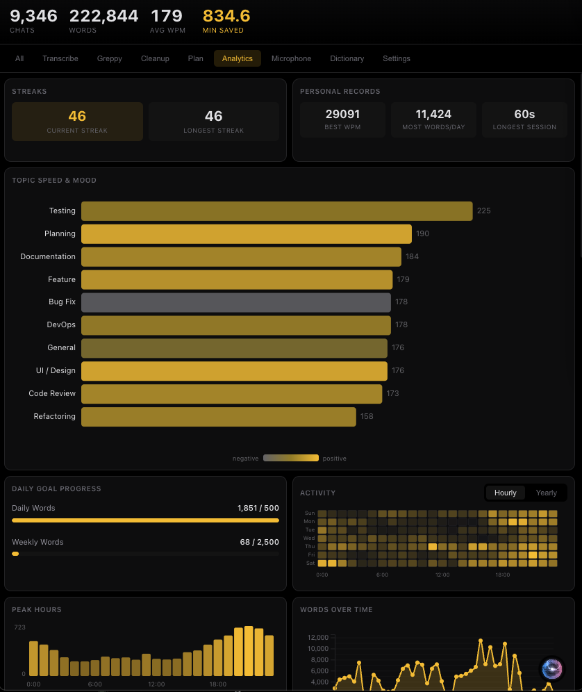

# VibeToText

Voice-to-text for developers featuring AI-powered cleanup and detailed analytics.


## Features

**Multi-Mode Hotkeys**
- `Ctrl+Shift` — Raw transcription
- `Cmd+Shift` — **Greppy** mode with semantic code search
- `Alt+Shift` — **Cleanup** mode (AI refines rambling into clear prompts)
- `Cmd+Alt` — **Plan** mode (generates structured implementation plans)

**Fast Local Transcription**
- Whisper.cpp for 2-4x faster transcription than Python Whisper
- Technical vocabulary bias for programming terms
- Auto-paste to cursor

**Cosmic Visualizations**
- Real-time 3D entity generation based on voice "vibe"
- Trellis-based mesh generation for complex structures
- GLB export for use in external tools

## Analytics & Settings



Press `Cmd+Comma` (macOS) or `Ctrl+Comma` (Windows) to open the **History & Settings** window.

**Statistics Dashboard**
- **Total Chats**: Number of recording sessions.
- **Total Words**: Cumulative dictation volume.
- **Top Words**: Frequency analysis excluding common stopwords.

**Management**
- **Recent History**: Review and copy previous transcriptions.
- **Microphone Selection**: Switch audio input devices directly from the UI.

## Install

```bash
pip install -e .
```

Optionally set `GEMINI_API_KEY` in a `.env` file to enable cleanup/plan modes.

### Windows

Run the build script to generate standalone executables:

```powershell
.\build_windows.bat
```

The executables will be available in the `dist/` folder.

## Usage

```bash
vibetotext              # Start with default hotkeys
vibetotext --model base # Use specific Whisper model
```
