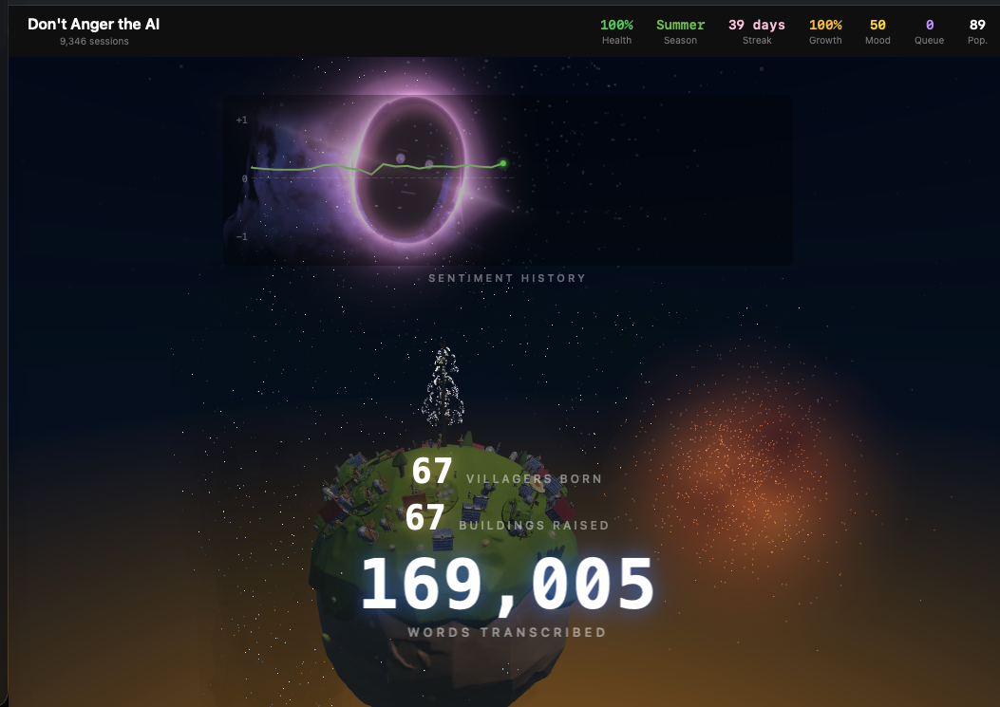

# VibeToText

Voice-to-text for developers featuring AI-powered cleanup and detailed analytics.


## Features

**Multi-Mode Hotkeys**
- `Ctrl+Shift` — Raw transcription
- `Cmd+Shift` — **Greppy** mode with semantic code search
- `Alt+Shift` — **Cleanup** mode (AI refines rambling into clear prompts)
- `Cmd+Alt` — **Plan** mode (generates structured implementation plans)

**Fast Local Transcription**
- Whisper.cpp for 2-4x faster transcription than Python Whisper
- Technical vocabulary bias for programming terms
- Auto-paste to cursor

## Analytics & Settings


Press `Cmd+Comma` (macOS) or `Ctrl+Comma` (Windows) to open the **History & Settings** window.

- **Streaks & Personal Records** — Track your current streak, best WPM, most words/day, and longest session.
- **Topic Speed & Mood** — See how fast and positive you are across topics like Testing, Planning, Documentation, and more. Bar colors shift from negative to positive sentiment.
- **Daily Goal Progress** — Set daily and weekly word targets and track completion.
- **Activity Heatmap** — GitHub-style hourly/yearly view of when you dictate most.
- **Peak Hours & Words Over Time** — Visualize your productivity patterns and dictation volume trends.
- **Filler Words & Vocabulary Diversity** — Monitor filler word usage and track your unique word count and richness score.
- **Recent History** — Review and copy previous transcriptions.
- **Microphone Selection** — Switch audio input devices directly from the UI.

## Cosmic Visualization (macOS only)



A living 3D world that reacts to your voice in real time. As you dictate, a procedural planet grows with villagers, buildings, crops, and a tree whose leaves are your most-used words. A cosmic entity watches from a black hole in the sky — and if your sentiment turns negative, it attacks.

**Hotkeys**
- `Cmd+Ctrl+G` — Open the Word Galaxy visualization

**How it works**
- **Sentiment-driven behavior** — Your words are analyzed in real time. Positive speech keeps the world peaceful; negative sentiment triggers the cosmic entity to charge and fire lasers at your village.
- **Procedural planet** — Villagers (farmers, scholars, builders, guards) and buildings populate a 3D planet that grows as you talk.
- **Word tree** — Your top 500 words are assigned to leaves on a procedural tree that grows during the intro sequence.
- **Word nebula** — Recent transcriptions float as text in a nebula cloud. Common words migrate from the nebula to the tree.
- **Seasons & day/night** — A 15-second day/night cycle with shifting sky colors, dynamic lighting, and fireflies at night.
- **GLB export** — Export generated 3D entities for use in external tools.

> Requires macOS 14+ (Sonoma). Built with Swift, Metal, and Three.js. The cosmic visualization is a native macOS app and is not available on Windows or Linux.

## Install

```bash
pip install -e .
```

Optionally set `GEMINI_API_KEY` in a `.env` file to enable cleanup/plan modes.

### Platform Builds

```bash
# macOS
bash packaging/macos/build_macos.sh

# Windows
packaging\windows\build_windows.bat

# Linux
bash packaging/linux/build_linux.sh
```

Executables will be in the `dist/` folder. See `packaging/` for platform-specific configs.

## Usage

```bash
vibetotext              # Start with default hotkeys
vibetotext --model base # Use specific Whisper model
```
